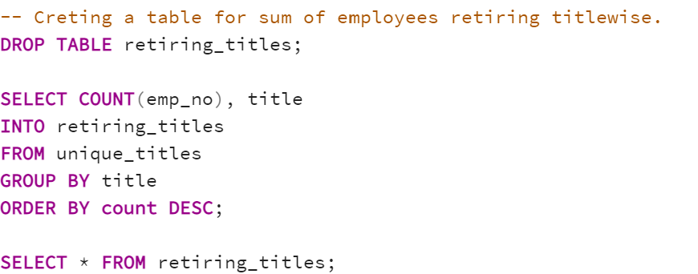
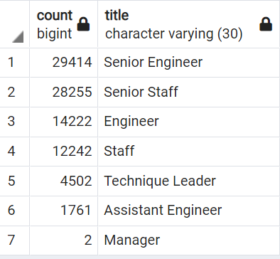
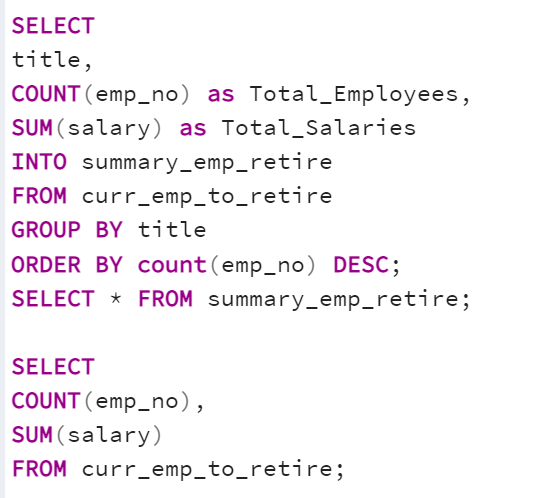
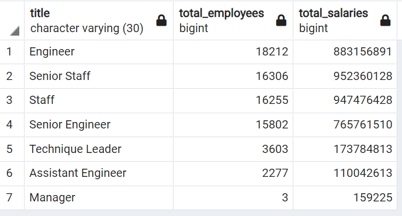
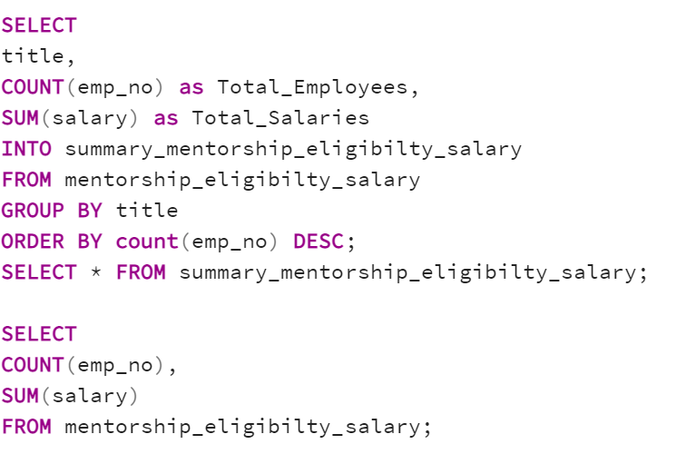
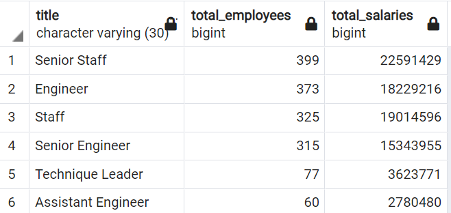

# Pewlett-Hackard-Analysis
## 1. Overview of the analysis: Explain the purpose of this analysis.
This analysis is done for Pewlett-Hackard, which is a large company boasting several thousand employees and its been around for a long time. Hence the baby boomers at the company begin to retire at a rapid rate. 	This analysis will help the company to 
1.	 Plan a retirement package for those who meet a certain criteria.
2.	Understanding which positions will open up due to the retirement and by when so as to be prepared to fill those positions with new candidates.
We are analyzing data for Bobby who works in Pewlett-Hackard as an HR Analyst and needs this analysis in order to future-proof Pewlett-Hackard by generating a list of employees eligible for retirement.
We have built an employee database with SQL by applying data modelling, engineering and analysis skills.
## 2. Results: 
### 1. ERD Schema - 
First and foremost is we created the schema and the core table of Pewlett-Hackard database thereby importing the data from the respective csv files. We also created an Entity Relationship Database(ERD) on Quick Database Diagrams (QDD) to understand the relationships between the different tables in relation to their primary and foreign keys. Below is the image of the same.
The first analysis is to determine the number of retiring employees per title, and identify employees who are eligible to participate in a mentorship program. 

### 2. The Number of Retiring Employees by Title :
 In our first query, in order to list all employees with a birth date from the year 1952 to 1955, we created a new table called retirement_titles by joining data from two other tables by retrieving the emp_no, first_name, and last_name columns from the Employees table and retrieving the title, from_date, and to_date columns from the Titles table. Below is the code for the same :

From the above table retirement.titles, we got a 133,776 rows, but this count has duplicate titles and also employees who already left the company 
	
### 3. Filter some employees that are duplicated as they have changed titles in the past-  In order to clean the database and remove the duplication we used the DISTINCT ON function and created a new database called unique_titles. Below is the code for the same.

And we discovered in this file, that the count of rows went down to 90,398 after removing the duplicate titles from the same company. But this count still has employees who have already left the organization.
	

#### Summary of the above employee list based on titles : To derive the title wise summary we used the following code :

### 4. The Employees Eligible for the Mentorship Program
 Finally we created a new query for deriving a list of employees eligible for the mentorship program. Here we created a new table called mentorship_eligibilty by using the DISTINCT ON function from the data retrieved from three other tables.
Below is the code

As we see in the mentorship_eligibility list, we discover that 1549 employees are eligible for a mentorship program. The number is good enough for the company to think of a concrete mentorship program to retain the skilled employees for some more time.

## 3. Summary : Provide high-level responses to the following questions, then provide two additional queries or tables that may provide more insight into the upcoming "silver tsunami."
### o	How many roles will need to be filled as the "silver tsunami" begins to make an impact?

All the employees that are born in the year 1952 to 1955 are due for a retirement soon. The total number of employees born from 1952 to 1955 is 90,398 out of which some employees have already left the organization giving us a total of 72,458 employees due to retire soon.
To dig deeper into the analysis, we wanted to understand the breakup of these employees titles wise and also salary-wise. So we used the following code to get those numbers :

72458 employees are about to retire soon, out of which 18212 being engineers and 16306 Senior staff which is the highest which means that the company needs to working on training the existing employees and promoting junior staff to the senior level which will lead to more positions opening at the junior level.

### o	Are there enough qualified, retirement-ready employees in the departments to mentor the next generation of Pewlett Hackard employees?
a.	Other than the above we also ran a query to get a list of employees born in the year 1965. As these employees won’t retire immediately, the company will have some time to plan a mentorship program for these employees. And the skilled employees can be moved to a role of a mentor in order to retain them for some more time and use their expertise to train the new employees. The total count of these employees is 1549. The company can use the salary totals to decide the range they want to spend in each title on the replacements.

The total salaries of these 1549 employees aggregates to $81,583,447. Keeping this in mind the company needs to first decide the budget and duration of the mentorship program that it will offer these employees.

