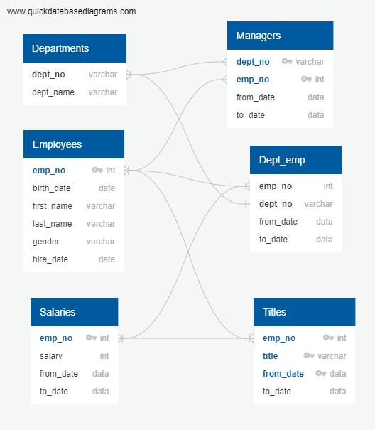
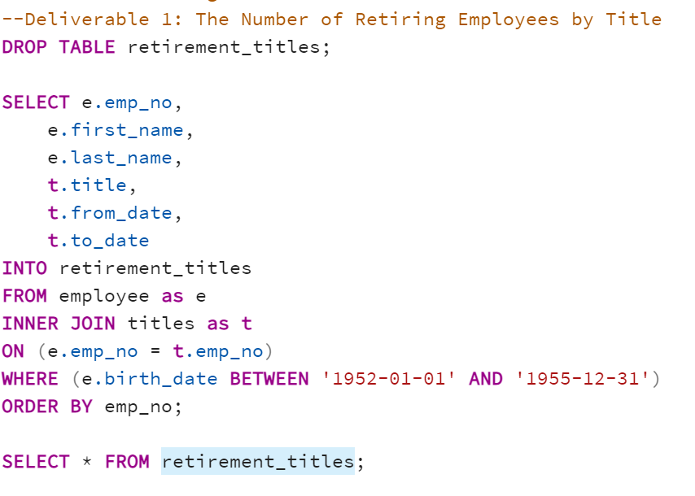
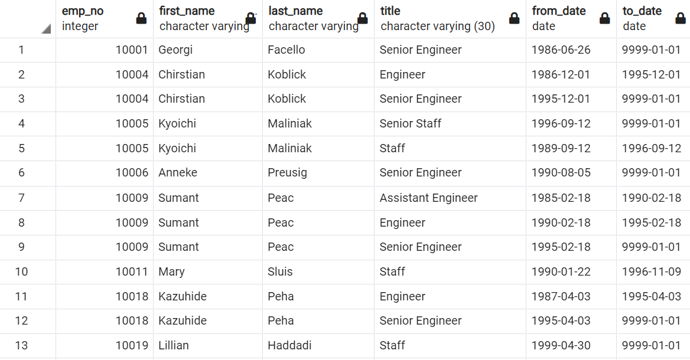
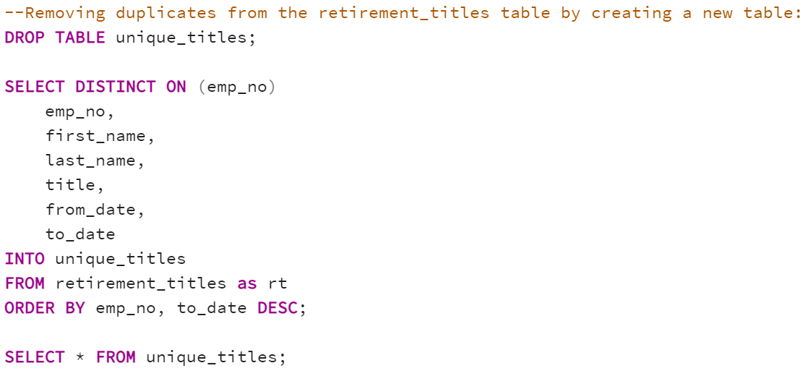
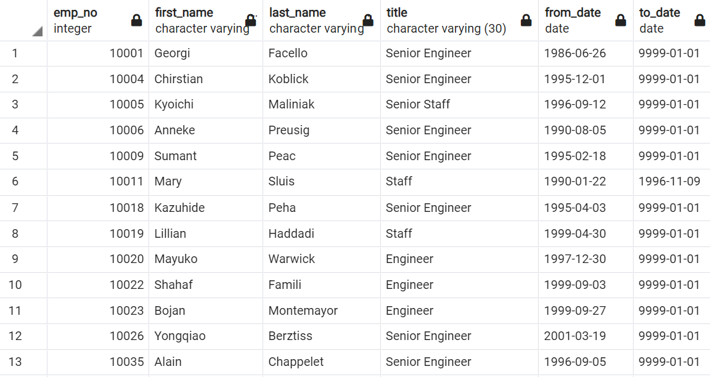
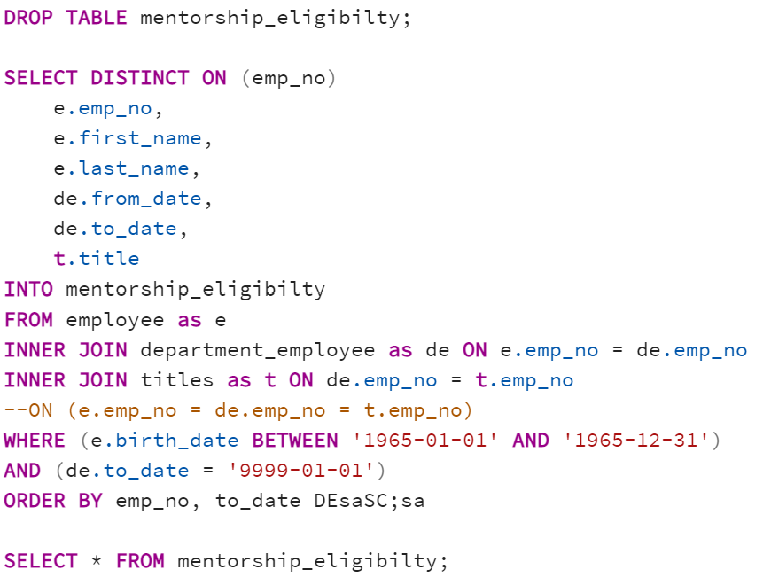
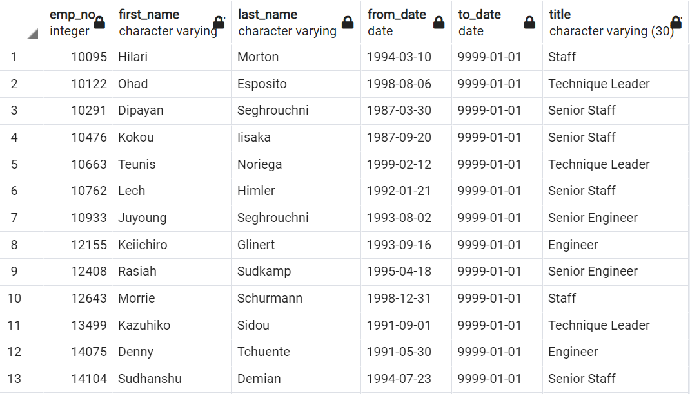

# Pewlett-Hackard-Analysis
## 1. Overview of the analysis: Explain the purpose of this analysis.
This analysis is done for Pewlett-Hackard, which is a large company boasting several thousand employees and its been around for a long time. Hence the baby boomers at the company begin to retire at a rapid rate. 	This analysis will help the company to 
1.	 Plan a retirement package for those who meet a certain criteria.
2.	Understanding which positions will open up due to the retirement and by when so as to be prepared to fill those positions with new candidates.
We are analyzing data for Bobby who works in Pewlett-Hackard as an HR Analyst and needs this analysis in order to future-proof Pewlett-Hackard by generating a list of employees eligible for retirement.
We have built an employee database with SQL by applying data modelling, engineering and analysis skills.
## 2. Results: Provide a bulleted list with four major points from the two analysis deliverables. Use images as support where needed.
### 1. ERD Schema - First and foremost is we created the schema and the core table of Pewlett-Hackard database thereby importing the data from the respective csv files. We also created an Entity Relationship Database(ERD) on Quick Database Diagrams (QDD) to understand the relationships between the different tables in relation to their primary and foreign keys. Below is the image of the same.
The first analysis is to determine the number of retiring employees per title, and identify employees who are eligible to participate in a mentorship program. 

### 2. The Number of Retiring Employees by Title :
 In our first query, we created a new table called retirement_titles by joining data from two other tables by retrieving the emp_no, first_name, and last_name columns from the Employees table and retrieving the title, from_date, and to_date columns from the Titles table. Below is the code for the same :

From the above table retirement.titles, we found that we had 133,776 employees who were born between 1952 and 1955 that were eligible for retirement soon.
	
### 3. But as we closely at the file we also discover that some employees are duplicated as they have changed titles in the past. In order to clean the database and remove the duplication we used the DISTINCT ON function and created a new database called unique_titles. Below is the code for the same.

And we discovered in this file, that the count of employees went down to 90398 employees after removing the duplicate titles from the same company.
	

### 4. The Employees Eligible for the Mentorship Program
 Finally we created a new query for deriving a list of employees eligible for the mentorship program. Here we created a new table called mentorship_eligibilty by using the DISTINCT ON function from the data retrieved from three other tables.
Below is the code

As we see in the mentorship_eligibility list, we discover that 1549 employees are eligible for a mentorship program. The number is good enough for the company to think of a concrete mentorship program to retain the skilled employees for some more time.

## 3. Summary : Provide high-level responses to the following questions, then provide two additional queries or tables that may provide more insight into the upcoming "silver tsunami."
o	How many roles will need to be filled as the "silver tsunami" begins to make an impact?
o	
o	Are there enough qualified, retirement-ready employees in the departments to mentor the next generation of Pewlett Hackard employees?

